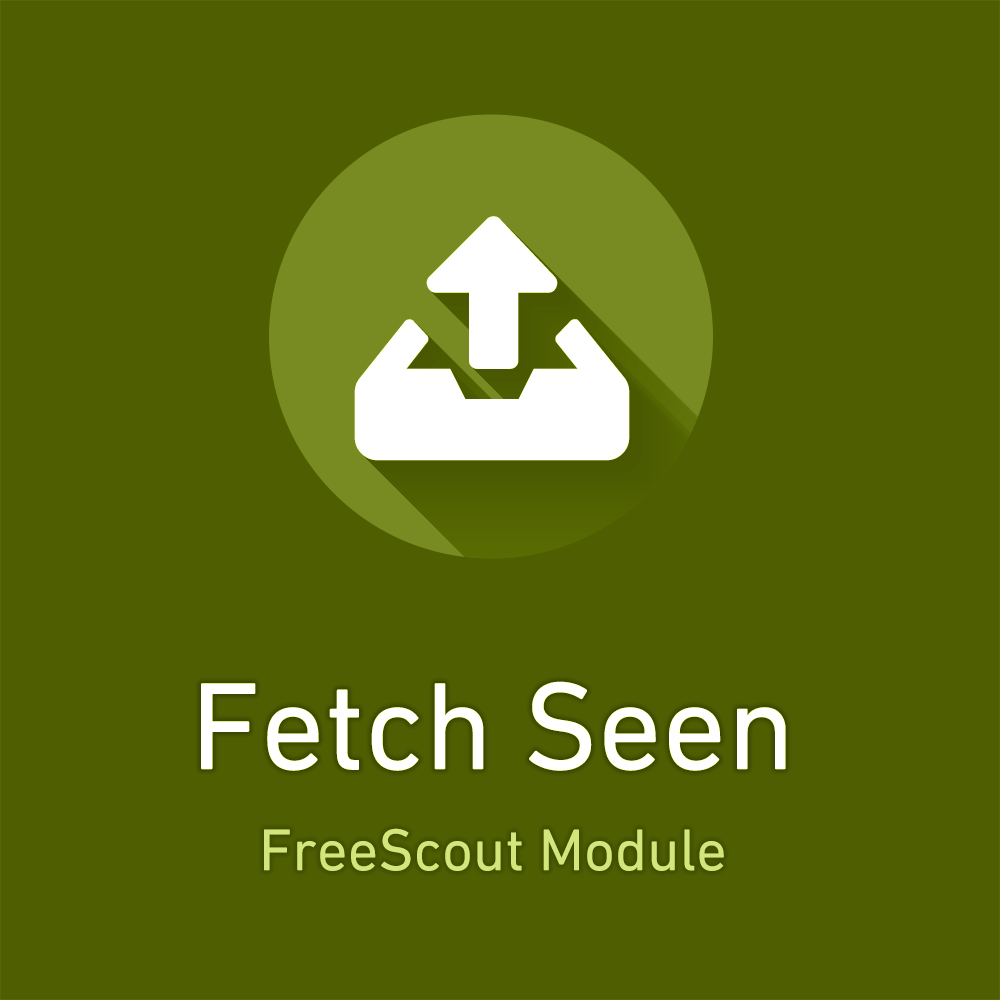

<!-- PROJECT LOGO -->
 

  

<h1 align="center">FreeScout Module: Fetch Seen</h1>

  

   The Fetch Seen Module optionally enables importing of seen emails on a mailbox basis.
     
     
    <a href="https://freescout.shop/downloads/freescout-module-fetch-seen/">View on FreeScout.shop</a>
    ·
    <a href="https://github.com/FreeScout-shop/fetch-seen/issues">Report Bug</a>
    ·
    <a href="https://github.com/FreeScout-shop/fetch-seen/issues">Request Feature</a>
  

  <h6 align="center">
    
Required FreeScout version: <strong>1.8.15</strong>

    
<strong>Translations included:</strong>
    🇨🇳 Chinese (simp.)  🇭🇷 Croatian 🇨🇿 Czech 🇳🇱 Dutch 🇬🇧 English 🇫🇷 French 🇩🇪 German 🇮🇳 Hindi 🇮🇹 Italian 🇯🇵 Japanese 🇵🇱 Polish 🇷🇺 Russian 🇸🇰 Slovak 🇪🇸 Spanish 🇸🇪 Swedish

  </h6>
  

    

    <strong>🎁 This FreeScout Module is free of charge for private and commecial use.</strong> 
    <small><em>We appreciate if you consider buying one of our <a href="https://freescout.shop/paid-freescout-modules/" target="_blank">other modules</a> though! 🙃</em></small>
    

  

<!-- TABLE OF CONTENTS -->

  
Table of Contents

  <ol>
    <li>
      <a href="#about-the-project">About The Project</a>
      <ul>
        <li><a href="#built-with">Built with</a></li>
      </ul>
    </li>
    <li>
      <a href="#getting-started">Getting Started</a>
      <ul>
        <li><a href="#prerequisites">Prerequisites</a></li>
        <li><a href="#installation">Installation</a></li>
      </ul>
    </li>
    <li><a href="#contact">Contact</a></li>
  </ol>

<!-- ABOUT THE PROJECT -->
## About The Project

The Fetch Seen Module optionally enables importing of seen emails on a mailbox basis.

Navigate to `Mailbox > Connection Settings > Fetching Emails` to enable the module for a mailbox.

 <small><em>A new setting will appear on the mailbox connection settings.</em></small>

(<a href="#top">back to top</a>)

### Built With

* [PHP](https://php.net/)
* [Laravel](https://laravel.com/)
* [FreeScout](https://freescout.net/)

(<a href="#top">back to top</a>)

<!-- GETTING STARTED -->
## Getting Started

TLDR; unpack [Module ZIP](https://freescout.shop/downloads/freescout-module-fetch-seen/) into `/Module` folder.

### Prerequisites

- Make sure you have write access to the `Modules` directory of your FreeScout installation.
- The required FreeScout Version is <strong>1.8.15</strong>. Go to "Manage" > "System" to see your current version.

### Installation

1. Download the module file (for free) from [https://freescout.shop](https://freescout.shop/downloads/freescout-module-fetch-seen/)
2. Open the FreeScout `Modules` folder, usually located at `/var/www/html/Modules`
3. Unzip the downloaded module file into the `/Modules` folder
4. Remove the ZIP file
5. In FreeScout, go to "Manage" > "Modules"
6. Click on "Activate" to enable the module

(<a href="#top">back to top</a>)

<!-- CONTACT -->
## Contact

[FreeScout.shop](https://freescout.shop) - service@freescout.shop

Download Link: [https://freescout.shop/downloads/freescout-module-fetch-seen/](https://freescout.shop/downloads/freescout-module-fetch-seen/)

Repository Link: [https://github.com/FreeScout-shop/fetch-seen](https://github.com/FreeScout-shop/fetch-seen)

(<a href="#top">back to top</a>)

